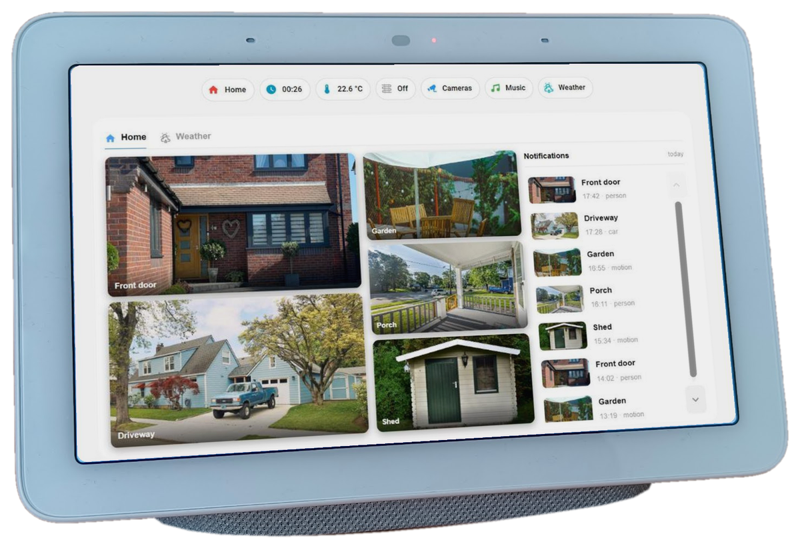
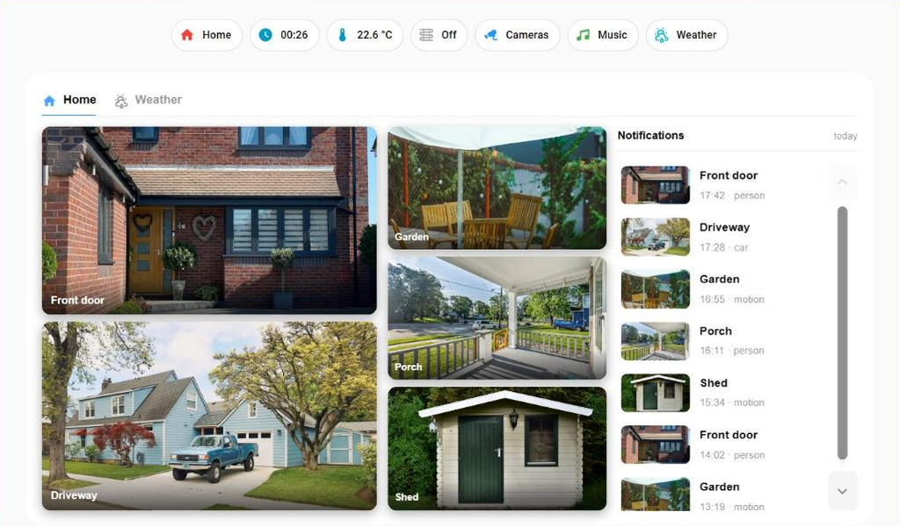
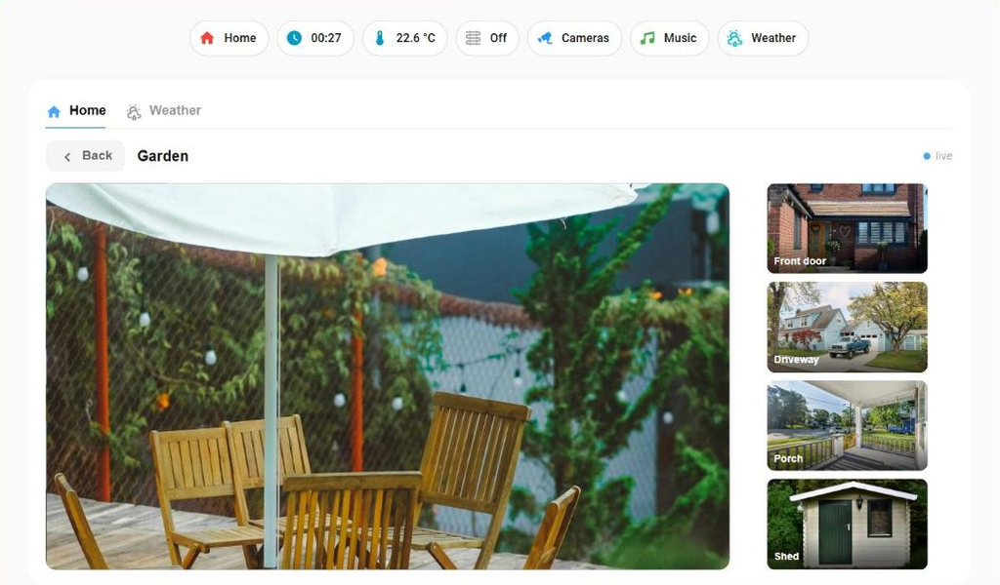
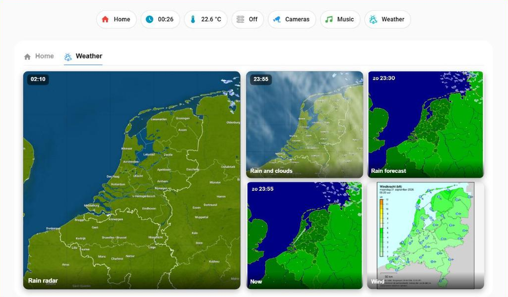
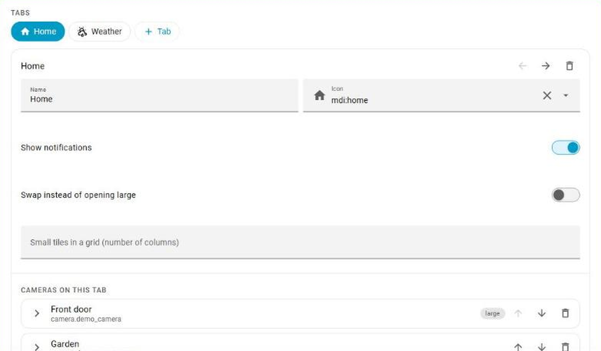
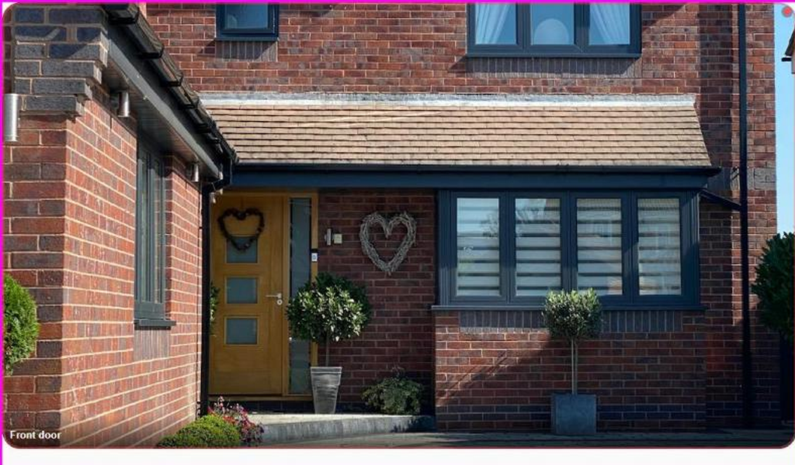

# Touch camera card



A Lovelace card that puts your cameras behind its own tabs, built for touch panels and for Google Nest Hub cast dashboards at 1024×600.

It was written for a second-hand Nest Hub on a desk. Those devices are cheap now and they are poor at playing H.264, which is why most camera cards either stutter on them or show nothing at all. This card does not try to fix that. It avoids it.

One file, two cards: **Touch camera card** for a wall of cameras with tabs, and **Touch camera tile** for a single camera between your other cards. They share the same engine.

It is made to work hand in hand with **[Frigate](https://frigate.video/)**. Any camera entity will show up, but with the Frigate integration the card also lists today's motion and person events beside the images, with a thumbnail for each, and plays the clip Frigate recorded when you tap one. Frigate's occupancy sensors can colour a tile the moment something moves. It is still useful without Frigate; you just get the images without the notifications.

It has a sibling for music: [Touch music card](https://github.com/mnrgrrt/touch-music-card) — same screen size, same thumb-first idea, and the two sit side by side as views on one dashboard.



*The Home tab at the 1024×600 of a Nest Hub — one large view, a column of small ones, and today's notifications beside them. Colours come from the Home Assistant theme, so it follows a dark theme just as well.*

*A note on the pictures: the Nest Hub at the top is my own, and the screenshots show the real card, but with stock photos from [Unsplash](https://unsplash.com/) in place of the camera images — I would rather not put my own house and garden on the internet. On your panel the tiles show your own cameras, of course.*



*Tap a tile and it opens large as an MJPEG stream, with the other cameras in a strip beside it. The dot says whether frames are still coming in.*

| A tab of weather radars | Everything from the dashboard editor |
| --- | --- |
|  |  |

## What it does

**Tabs of your own.** Group your cameras however you like — by house, by floor, by whatever. Each tab has one large image and a column or grid of small ones; tap a small one to open it large, or set the tab to swap instead, so the tapped tile takes the large spot and the page never changes.

**A layout that follows your cameras.** Cameras marked `large` stack on the left and share its height; the others form a column beside them and share that height too, so the more small cameras there are, the smaller and narrower they get — and the notifications column takes whatever width is left. The screenshots show five cameras. With six, two large and four small, as on the author's own Nest Hub, the small tiles are smaller and the notification list is wider. The strip beside a camera opened large works the same way: it holds every other camera on the tab.

**Three different techniques, each for what it is good at.** The small tiles are plain snapshots that refresh on a timer: nothing that can break, and it recovers by itself. The large view is an MJPEG stream straight from Home Assistant — one `` element, no MediaSource, no WebRTC, no decoder, about 22 ms to the first frame. Notification clips are the mp4 that Frigate already wrote, which plays anywhere.

**A watchdog on the large view.** An MJPEG stream that stalls looks exactly like a scene that is not moving — the last frame just stays there. On a camera that is the most dangerous failure there is. So every two seconds the card takes a tiny sample of the image and compares it. Sensor noise makes sure two real frames are never identical; if the sample stays the same, nothing is coming in, and the card falls back to fast snapshots and says so on screen.

**Notifications beside the images.** Today's motion and person events per camera, with the thumbnail, and the clip plays on a screen of its own on top of the card.

**Tiles that are not cameras.** A tile can hold any ordinary Lovelace card — a forecast, a sensor graph — or a live weather radar built from map tiles. The clock on a weather tile gives the time of the picture and how far that is from now — `10:05 · +30 min`, `09:20 · −15 min`, `tue 05:00 · +19 h` — so you can always tell a forecast from a look back.

**A form for everything.** Tabs, cameras, settings: all of it from the dashboard editor, no YAML needed. The code editor keeps working and stays authoritative for keys the form does not know about.

## Install

HACS does not list this card, so add it as a custom repository:

1. HACS → three dots at the top right → **Custom repositories**
2. URL: `https://github.com/mnrgrrt/touch-camera-card`, category **Dashboard**
3. Install **Touch camera card**, then hard-refresh your browser

Or copy `touch-camera-card.js` to `config/www/` yourself and add it under Settings → Dashboards → three dots → Resources as `/local/touch-camera-card.js`, type JavaScript module.

## What you need

- **Camera entities** in Home Assistant. Any kind will do: the tiles use snapshots and the large view uses Home Assistant's own MJPEG stream.
- **For the notifications: the [Frigate integration](https://github.com/blakeblackshear/frigate-hass-integration).** The card asks Frigate for today's events of the camera with the same name as the entity: for `camera.front_door` it looks for the Frigate camera `front_door`. The clips are the mp4 files Frigate recorded. Cameras Frigate does not know simply show no notifications. No Frigate at all? Set `notifications: false`.
- The weather tiles need nothing extra — see below.

## Minimal configuration

```yaml
type: custom:touch-camera-card
tabs:
  - name: Home
    icon: mdi:home
    cameras:
      - name: Front door
        entity: camera.front_door
        large: true
      - name: Garden
        entity: camera.garden
      - name: Shed
        entity: camera.shed
```

That is enough. Everything below is optional.

## Options

### Card

| Key | Default | What it does |
| --- | --- | --- |
| `tabs` | — | Required. The list of tabs. |
| `height` | — | Fixed height in pixels. |
| `fill` | `false` | Work out the height from the space available instead. |
| `fill_margin` | — | Space to leave at the bottom when filling. |
| `refresh` | `1` | Seconds between snapshots on the tiles. |
| `stream` | `true` | Use an MJPEG stream for the large view. |
| `large_refresh` | `0.5` | Snapshot rate in the large view after a fallback. |
| `stalled_after` | `6` | Seconds without a new frame before the watchdog steps in. |
| `notifications` | `true` | Show the notifications column. |
| `notification_count` | `20` | How many notifications in the list. |
| `notifications_per_camera` | `8` | How many per camera are fetched. |
| `notification_width` | — | Width of a notification thumbnail in pixels. |
| `clip_timeout` | `20` | Give up on a recording after this many seconds. |
| `clip_loop` | `true` | Loop the recording. |

### Tab

| Key | Default | What it does |
| --- | --- | --- |
| `name` | — | The label on the tab. |
| `icon` | — | An `mdi:` icon beside it. |
| `cameras` | — | The tiles in this tab. |
| `swap` | `false` | Tapping a small tile moves it into the large spot instead of opening it. |
| `grid` | — | Spread the small tiles over a grid of this many columns. |
| `notifications` | inherits | Turn the notifications column off for this tab. |

### Camera

| Key | Default | What it does |
| --- | --- | --- |
| `name` | — | The label on the tile. |
| `entity` | — | A `camera.` entity. |
| `large` | `false` | Start in the large spot. |
| `crop` | `true` | Crop to 16:9. Set to `false` for an image you want to see whole. |
| `ratio` | `16/9` | A custom aspect ratio, for example `550/512`. |
| `refresh` | inherits | Snapshot rate for this tile alone. |
| `motion` | — | A `binary_sensor` that marks the tile on motion. |
| `person` | — | A `binary_sensor` that marks it differently for a person. |
| `card` | — | Any Lovelace card configuration, shown in the tile instead of a camera. |
| `weather` | — | A weather map instead of a camera: `rain` (next two hours, every 5 minutes), `rain-and-clouds` (the past hour, radar over satellite) or `rain-24h` (the next 24 hours, one picture per hour; the Netherlands only). |
| `hours` | `24` | With `rain-24h`: how many hours ahead, up to 48. |
| `place` | your home | With `rain` and `rain-and-clouds`: where the map is centred. A place name — `Texel`, `Chamonix`, `Paris, US` (add a two-letter country code when a name exists in more countries) — or an entity with a position, such as `zone.work` or `person.anna`. Leave it out and the map centres on the home location set in Home Assistant. |
| `latitude`, `longitude` | — | The same as `place`, as exact coordinates. These win when both are given. |
| `zoom` | `8` | With `rain` and `rain-and-clouds`: how far in. 7 shows a larger region, 9 a smaller one. |

## Weather tiles: what works where

A weather tile needs no camera and no integration. Without any setting it centres on the home location of your Home Assistant, so for most people this is enough:

```yaml
- name: Rain
  weather: rain
```

Somewhere else — a holiday home, the mountains you are going to, family abroad:

```yaml
- name: Rain in Chamonix
  weather: rain
  place: Chamonix
```

A place name is looked up once with the free [Open-Meteo geocoder](https://open-meteo.com/en/docs/geocoding-api) and then remembered in the browser. An entity such as `zone.work` needs no lookup at all. If a name is not found, the tile says so.

| Type | Shows | Where |
| --- | --- | --- |
| `rain` | Precipitation for the next two hours, a picture every 5 minutes | Worldwide |
| `rain-and-clouds` | The past hour: precipitation and clouds from satellite | Worldwide |
| `rain-24h` | Precipitation for the next 24 hours (up to 48), a picture per hour | The Netherlands only |

Good to know before you rely on it:

- **These are not official, documented services.** The pictures come from Infoplaza, the company behind the Dutch weather site Weerplaza, from the same addresses their own website uses. They allow the pictures to be loaded from other sites, and the card has run on them without trouble, but there is no public API with promises attached. They can change or close it without notice, and then the tile shows *unreachable*.
- **Outside Europe it comes from a worldwide product.** Tested for North and South America, Australia, Japan and India: precipitation shows up everywhere. How it compares with your own national weather radar is something only you can judge.
- **`rain-24h` only exists for the Netherlands.** It is a single fixed map of the country; there is no version for anywhere else.

If none of this suits you, you don't need it. **Any tile can show any camera entity or any Lovelace card instead** — your national weather service's radar image as a generic camera, a forecast card, a sensor graph — and a tab full of those works exactly the same. You don't have to have a weather tab at all.

### Recipes: more weather images

The tiles on the author's own weather tab, besides the built-in ones, are two ordinary camera entities. Both come from integrations that ship with Home Assistant; nothing here is part of this card.

**Buienradar (the Netherlands and Belgium).** Add the [Buienradar integration](https://www.home-assistant.io/integrations/buienradar/) under Settings → Devices & services. Among other things it creates `camera.buienradar`, the current radar picture, refreshed every few minutes.

**Any weather picture on the internet.** Many weather services publish a map as a plain image at a fixed address that is refreshed in place. Add the [Generic Camera](https://www.home-assistant.io/integrations/generic/) integration, paste that address as *Still image URL*, leave *Stream source* empty, and you have a camera entity. The wind map of the Dutch weather service KNMI, for example:

```
https://cdn.knmi.nl/knmi/map/page/weer/actueel-weer/windkracht.png
```

Look for the same kind of image on your own national weather service's site: right-click the map, *Copy image address*, and check that the address stays the same when the map updates.

Then put them on a tab. Maps are rarely 16:9, so switch off cropping and give the real shape, and do not refresh them more often than the source changes:

```yaml
- name: Weather
  icon: mdi:weather-partly-rainy
  notifications: false
  cameras:
    - name: Rain · next 2 hours
      weather: rain
      large: true
    - name: Buienradar · now
      entity: camera.buienradar
      crop: false
      ratio: 550/512
      refresh: 30
    - name: Wind · now
      entity: camera.knmi_wind
      crop: false
      ratio: 550/512
      refresh: 300
```

## The second card: one camera, one tile

The file also installs `touch-camera-tile`. Same engine — the same snapshot timer, the same watchdog — but one camera and nothing around it, for use between the other cards on a dashboard.

It exists because Home Assistant's own picture card gets its image from a loop that can quietly stop on a page that stays open for days: a wall panel, a cast dashboard. The rest of the dashboard carries on, so nobody notices — the last frame simply stays there.



```yaml
type: custom:touch-camera-tile
entity: camera.front_door
person: binary_sensor.front_door_person
grayscale: true
radius: 36
ring: 7
refresh: 2
navigate: /lovelace/cameras
```

| Key | Default | What it does |
| --- | --- | --- |
| `entity` | — | Required. A `camera.` entity. |
| `name` | — | A label over the image. Leave it out and none is drawn. |
| `motion` | — | A `binary_sensor`; the tile gets an amber ring while it is on. |
| `person` | — | A `binary_sensor`; a red ring, and the colour returns if `grayscale` is set. |
| `grayscale` | `false` | Show the image in grey until the `person` sensor turns on. |
| `radius` | `20` | Corner rounding in pixels. |
| `ring` | `7` | Thickness of the alert ring in pixels. |
| `refresh` | `1` | Seconds between snapshots. |
| `crop` | `true` | Crop to 16:9. |
| `ratio` | `16/9` | A custom aspect ratio. |
| `navigate` | — | A dashboard path; a tap goes there. Without it, a tap opens the camera's own dialog. |

`grayscale` is worth a word. The image sits there in grey and the colour returns the moment a person is seen. A still grey scene is easy to ignore, which is exactly what you want from a camera on a dashboard you look at all day, and colour coming back catches the eye harder than any border does.

## Goes well with

**[Touch music card](https://github.com/mnrgrrt/touch-music-card)** — Music Assistant behind one screen, for the same Nest Hub: speakers along the top, what is playing on the left, playlists, radio and search on the right, with an on-screen keyboard. Put both cards on their own view of one cast dashboard and give each a navigation button to the other; the music card has `links` for that.

## Status

This runs on my own Nest Hub every day. I made it for myself, and I am sharing it because someone else might have the same small screen on their desk.

I would really like to hear what you think of it. Are you using it, and on what? Did you change something, or build something on top of it? Is there an idea that would make it better? Open an [issue](https://github.com/mnrgrrt/touch-camera-card/issues) and tell me — good ideas are very welcome, and so is simply telling me it works for you.

Be aware that I do not maintain it actively. I work on it now and then when I have time, so an answer or a fix can take a while. Pull requests are welcome and I will look at them, and you are free to fork it and make it your own without asking.

It is one file with no build step — no npm, no bundler, no TypeScript. Open it in an editor and change what you want. That is deliberate.

## Licence

MIT. See [LICENSE](LICENSE).
